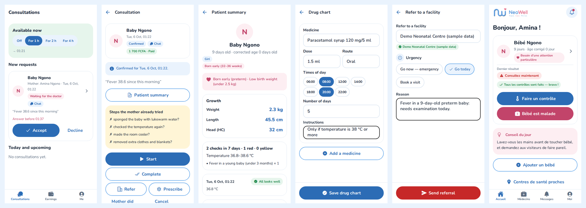

# NeoWell — Mobile App

**Track. Care. Thrive.** NeoWell helps mothers and caregivers in Cameroon watch their newborn at home, and connects them with verified doctors.

The app is built with **React Native + Expo (SDK 57)**, Expo Router and TypeScript, and targets Android first. It talks to the [NeoWell backend API](https://github.com/Cheneba/neowell-backend). The design documents, including the [Front-End Design Guide](https://github.com/Cheneba/neowell-backend/blob/main/docs/07-frontend-design-guide-v1.0.md), are in the backend's `docs/` folder.

**Caregiver:** sign in → profile → consent → add baby → daily check → unwell check → result → book a doctor → pay → consultation → medicines


**Doctor:** consultations → room → patient summary → prescribe → refer, plus the app in French



## Run it

```bash
npm install
cp .env.example .env        # set EXPO_PUBLIC_API_URL to your backend
npx expo start              # then press "a" for Android, or scan the QR code with Expo Go
```

- **The backend must be running** (see the neowell-backend README). On a physical phone, set `EXPO_PUBLIC_API_URL` to your computer's LAN IP, e.g. `http://192.168.1.20:3000`, or to the deployed backend URL.
- **Sign-in codes** are printed in the backend's log until an SMS provider is connected.
- **`npx expo start --web`** runs the same app in a browser. This is handy for quick previews.

| Command | What it does |
| --- | --- |
| `npx expo start` | Dev server (Android / iOS / web) |
| `npm test` | Unit tests (translations, API client, input helpers, check plans, offline queue, baby form, doses, availability) |
| `npx tsc --noEmit` | Type check |
| `npx expo lint` | Lint |

## What's in the app (v2)

**Caregivers**
| Screen | What it does |
| --- | --- |
| Sign in / profile / consent | Phone + SMS code. First and last name: the baby is called **"Baby {last name}"** for the first 42 days, as in hospital files ("Bébé …" in French). Consents to store checks and share them with chosen doctors. |
| Home | Each baby with age (and corrected age if preterm), "needs extra care" flag, kangaroo care / hospital pause, last result, checks due, pending temperature re-check, tip of the day, unread notifications |
| Add / edit baby | 3 steps: sex, date of birth, optional name · weeks of pregnancy, weight, length, head circumference (HC) from the hospital booklet · birth facility and where the baby is now |
| Daily check | Questions come from the server's check plan: temperature first, room/clothing questions when the temperature is off, a 60-second breath counter, optional photo |
| Baby is unwell | Choose complaints (fever, not feeding, fits…), describe them in writing or with a voice note, then answer follow-up questions |
| Result | Traffic light, what was noticed, what to do (no home medicines for newborns, cooling steps), 30-minute re-check reminder, fits explainer, emergency numbers, nearest facility, **Talk to a doctor** |
| Growth | Latest weight, length and HC against WHO standards, with measurement history and updates |
| Doctors → book → pay | Verified doctors with fees per medium (chat, voice, video), available now or by time slot, fever checklist before booking, MTN MoMo / Orange Money payment |
| Consultation | Status, chat with photos (contact details masked), call link, referral with hospital code and call buttons, drug chart, doctor's notes, cancel (with refund rule), rating |
| Medicines | Drug charts with dose reminders on the phone and Given / Skip per dose |
| Inbox, Me | Notifications; language, consents, data export, account deletion |

**Doctors** (sign in with "I am a doctor")
| Screen | What it does |
| --- | --- |
| Setup and verification | Professional profile, fees per medium, payout number; upload photo, licence, degree and proof of employment |
| Consultations | "Available now" switch, new requests with accept/decline before the deadline, upcoming and past |
| Consultation room | Patient 7-day summary, the mother's pre-booking checklist, chat, call, start/complete with notes, no-show, refer, prescribe |
| Earnings, availability, Me | Pending and paid earnings with payouts, weekly hours, public profile preview |

**Offline:** a check recorded without internet is saved on the phone and sent automatically later (no duplicates). If it contains danger signs, the app still says "Seek care now". Check reminders and medicine alarms are local notifications, so they work offline too.

**Calls** open the backend's call page in the browser, so they work in Expo Go. Server push needs an EAS project id in `app.json` (`extra.eas.projectId`); without it, the app relies on local reminders and the in-app inbox.

## Design

- **Colours:** the logo's blue `#62A6EA` and pink `#F0849F`, on white. Darker shades (`#2C6CB5`, `#C2446A`) are used for text and buttons so they stay readable (WCAG AA contrast). The traffic-light colours are only used for results.
- **Font:** Nunito, a rounded typeface that matches the logo.
- **Accessibility:** large touch targets (56 px), and results always shown with colour **plus** an icon **plus** text (PDR §6). Screen-reader labels are on all controls.
- **Languages:** English and French. `src/i18n/fr.ts` is type-checked against `en.ts`, so a missing translation fails the build. A test also checks that every triage code the backend can return has text in both languages.

## Project structure

```
src/
├── app/                      Routes (Expo Router — every file is a screen)
│   ├── _layout.tsx           Fonts, providers, guards: auth → onboarding → caregiver or clinic
│   ├── (auth)/               sign-in, verify
│   ├── onboarding/           profile, consent
│   ├── (caregiver)/          (tabs): home, doctors, inbox, me · baby/… · result · facilities ·
│   │                         doctors/[id] · doctors/[id]/book · consultation/[id] (pay, review)
│   └── clinic/               setup · (tabs): consultations, earnings, me · documents · availability ·
│                             consultation/[id] (patient, refer, prescribe)
├── api/                      Typed backend client (token refresh, uploads) + response types
├── components/               UI kit (buttons, fields, banners, pills, risk badge, logo)
├── features/                 checks/ (questions, breath counter, voice, offline queue) · babies/ ·
│                             growth/ · consultation/ (room, chat, cards) · clinician/ ·
│                             notifications/ (push, reminders, dose alarms) · account/
├── content/                  Daily tips (EN/FR)
├── i18n/                     en.ts, fr.ts, translate()
├── lib/                      Session, secure storage, formatting, phone/date/temperature helpers
└── theme/                    Colours, fonts, spacing
```

## Next steps

- [ ] Clinical knowledge base from the product owner's disease spreadsheet (conditions, home remedies, severity)
- [ ] EAS project and builds for the Play Store (also enables server push)
- [ ] In-app calls with the LiveKit native SDK (needs a development build)
- [ ] More local languages and a Bluetooth thermometer
