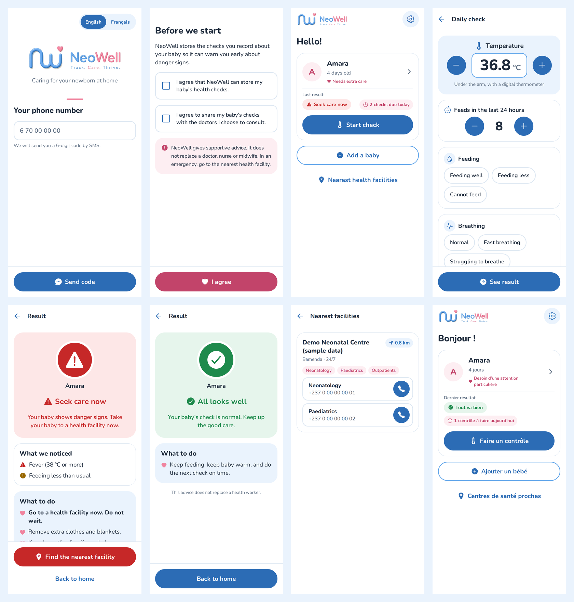

# NeoWell — Mobile App

**Track. Care. Thrive.** NeoWell helps mothers and caregivers in Cameroon watch their newborn at home.

In the app, a caregiver can:
- record a quick daily check
- get an instant 🟢 Green / 🟡 Yellow / 🔴 Red result with clear advice
- find the nearest facility that can care for newborns

The app is built with **React Native + Expo (SDK 57)**, Expo Router and TypeScript, and targets Android first. It talks to the [NeoWell backend API](https://github.com/Cheneba/neowell-backend).



## Run it

```bash
npm install
cp .env.example .env        # set EXPO_PUBLIC_API_URL to your backend
npx expo start              # then press "a" for Android, or scan the QR code with Expo Go
```

- **The backend must be running** (see the neowell-backend README). On a physical phone, set `EXPO_PUBLIC_API_URL` to your computer's LAN IP, e.g. `http://192.168.1.20:3000`, or to the deployed backend URL.
- **Sign-in codes** are printed in the backend's log until an SMS provider is connected.
- **`npx expo start --web`** runs the same app in a browser. This is handy for quick previews.

| Command | What it does |
| --- | --- |
| `npx expo start` | Dev server (Android / iOS / web) |
| `npm test` | Unit tests (translations, API client, input helpers) |
| `npx tsc --noEmit` | Type check |
| `npx expo lint` | Lint |

## What's in this first version

| Screen | What it does |
| --- | --- |
| Sign in | Phone number → 6-digit SMS code (Cameroon numbers typed as `6 70 00 00 00` are accepted) |
| Consent | Explicit consent to store checks and share them with chosen doctors, plus a safety disclaimer |
| Home | Each baby with age, a "needs extra care" flag for preterm or low-birth-weight babies, last result and checks due today |
| Add baby | Name, sex, date of birth, birth weight, weeks of pregnancy |
| Daily check | One screen: large temperature control, feeds counter, and tap-to-answer danger-sign questions |
| Result | Traffic light with icon and text, what was noticed, what to do, emergency numbers, and a link to the nearest facilities |
| Facilities | Nearest newborn-capable facilities by GPS, with one-tap department phone calls |
| Settings | English / Français, sign out |

## Design

- **Colours:** the logo's blue `#62A6EA` and pink `#F0849F`, on white. Darker shades (`#2C6CB5`, `#C2446A`) are used for text and buttons so they stay readable (WCAG AA contrast). The traffic-light colours are only used for results.
- **Font:** Nunito, a rounded typeface that matches the logo.
- **Accessibility:** large touch targets (56 px), and results always shown with colour **plus** an icon **plus** text (PDR §6). Screen-reader labels are on all controls.
- **Languages:** English and French. `src/i18n/fr.ts` is type-checked against `en.ts`, so a missing translation fails the build. A test also checks that every triage code the backend can return has text in both languages.

## Project structure

```
src/
├── app/                  Screens (Expo Router — every file is a route)
│   ├── _layout.tsx       Fonts, providers, and auth/consent route guards
│   ├── (auth)/           sign-in, verify
│   ├── consent.tsx
│   └── (app)/            home, baby/new, baby/[id], baby/[id]/check, result, facilities, settings
├── api/                  Typed backend client (auto token refresh) + response types
├── components/           UI kit (buttons, fields, option chips, risk badge, logo)
├── i18n/                 en.ts, fr.ts, translate()
├── lib/                  Session, secure storage, phone/date/temperature helpers
└── theme/                Colours, fonts, spacing
```

## Next steps

- [ ] Reminder notifications for each check time (3/2/1 per day by age)
- [ ] Offline mode: queue checks without internet and sync later
- [ ] Teleconsultation booking and mobile money payment
- [ ] Voice input for mothers with low literacy, and more local languages
- [ ] Bluetooth thermometer
- [ ] EAS build configuration for Play Store releases
